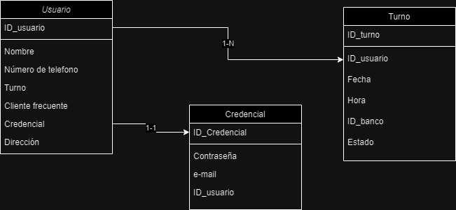

# Aplicación para la gestión de turnos Casino

## Introduccion
La plataforma de servicios de casino en línea ofrece a los usuarios la posibilidad de registrarse utilizando su dirección de correo electrónico y una contraseña, permitiéndoles completar su perfil una vez registrados. Los usuarios también pueden subir fotos para personalizar aún más su perfil.

Una vez que un usuario se ha registrado con éxito, tiene la capacidad de programar visitas al casino. Esto incluye la opción de agendar, reagendar o cancelar visitas según sea necesario. Después de confirmar la visita, se envía un correo electrónico de confirmación al usuario a la dirección proporcionada durante el registro. Además, los usuarios pueden editar su perfil en cualquier momento desde la plataforma.

En la página principal de la plataforma, los usuarios son recibidos con una introducción al casino y un menú de navegación que incluye las opciones de "Ingresar" y "Registrarse". Una vez que han iniciado sesión en su cuenta, pueden seleccionar un juego específico, elegir el casino, así como la fecha y hora para su visita correspondiente.

Para facilitar este proceso, la plataforma ofrece formularios de registro detallados y un sistema de programación de visitas intuitivo. Después de seleccionar el juego deseado, los usuarios pueden visualizar y administrar sus visitas en el panel de servicios, donde tienen acceso a toda la información pertinente, incluido el estado de las visitas. En esta sección, también tienen la opción de cancelar o reagendar visitas según sea necesario.

## Historias

### Usuario invitado
- **Página de inicio:** Interfaz principal que muestra una introducción al banco y destacados como promociones o noticias.
- **Barra de navegación:** Incluye enlaces a secciones informativas como "Quiénes somos", "Historia", etc., facilitando la exploración del sitio.
- **Sección de ingreso/registro:** Destacada en la página de inicio, permite a los usuarios iniciar sesión si ya tienen una cuenta o registrarse si son nuevos.

### Registrar usuario
- Dar contraseña.
- Proporcionar dirección de correo electrónico.

### Agendar turno
- Seleccionar fecha y hora.
- Elegir el servicio requerido.
- Seleccionar el banco.

### Cancelar cita
- Acceder a la sección de citas programadas.
- Seleccionar la cita a cancelar.
- Confirmar la cancelación.

### Reprogramar
- Acceder a la sección de citas programadas.
- Seleccionar la cita a reprogramar.
- Seleccionar nueva fecha y hora.

### Confirmar cita
- Recibir correo electrónico de confirmación.
- Confirmar cita mediante enlace o botón proporcionado.

### Editar usuario
- Subir foto de perfil.
- Cambiar contraseña.
- Cambiar dirección de correo electrónico.

### Usuario invitado
- Página de inicio: Interfaz principal que muestra una introducción al banco y destacados como promociones o noticias.

- Barra de navegación: Incluye enlaces a secciones informativas como "Quiénes somos", "Historia", etc., facilitando la exploración del sitio.

- Sección de ingreso/registro: Destacada en la página de inicio, permite a los usuarios iniciar sesión si ya tienen una cuenta o registrarse si son nuevos.

### Registrar usuario
- Dar contraseña.
- Proporcionar dirección de correo electrónico.

### Agendar turno
- Seleccionar fecha y hora.
- Elegir el servicio requerido.
- Seleccionar el banco.

### Cancelar cita
- Acceder a la sección de citas programadas.
- Seleccionar la cita a cancelar.
- Confirmar la cancelación.

### Confirmar cita
- Recibir correo electrónico de confirmación.

## DB diseño

